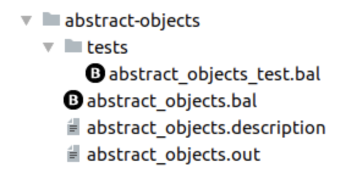
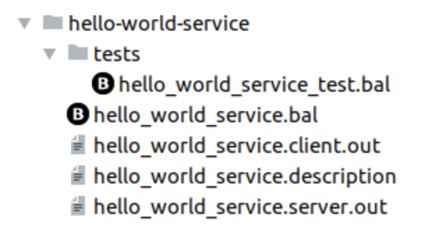
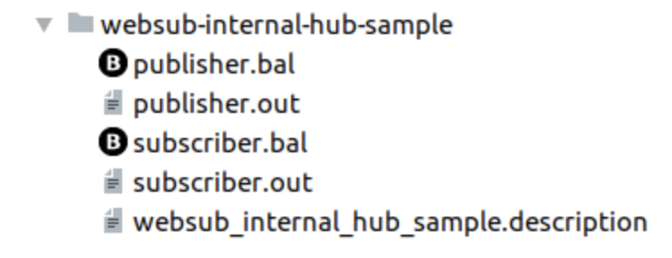

# Guidelines for Writing Ballerina By Examples (BBEs)

- [General best practices](#general-best-practices)
- [Practices related to the code comments](#practices-related-to-the-code-comments)
- [Practices related to the folder structure](#practices-related-to-the-folder-structure)

## General best practices

1. Format the Ballerina source using an IDE Plugin.

2. Always, think about the length of the example. A good example should be short.

3. As a practice, use `<code>ballerina/io`</code> methods in main examples and `<code>ballerina/log</code>` in services examples. Do not use both `<code>io:println</code>` and `<code>log:printInfo</code>` in the same example.

4. The maximum character count per line should be 80 in .bal files. Otherwise, the lines will be wrapped in the [b.io](https://ballerina.io/) reducing the readability.

    Example;

    

5. All keywords and any other word, which needs to be highlighted should be added within backquotes (e.g., `xml`). Do not use a single quote as it will not get highlighted. 

    Example;

    - In the code:

        

    - In the b.io:

        


6. Remove unused imports in `.bal` files.

7. If a new example is added/deleted, update the [index.json](https://github.com/ballerina-platform/ballerina-lang/blob/master/examples/index.json) file as well.

## Practices related to the code comments

1. Add comments to the code blocks as much as possible by starting them with “//”. They will be moved to the RHS boxes in the [b.io](https://ballerina.io/) as a mechanism to describe the code.

    Example;

    - In the code:

        

    - In the b.io:

        

2. Since comments are used in the RHS as a mechanism to describe the code, they should be valid sentences (i.e., start with an upper case letter and end with a full stop etc.).

3. After a comment is strated, it will continue being applied to the subsequent lines in the file until another comment or an empty line is found. Therefore, use comments/new lines appropriately to ensure that they apply only to the relevant lines.

4. There is no restriction on the max number of chars that should be there in comment lines as they get wrapped automatically in the RHS side in the [b.io](https://ballerina.io/). However, since users can refer the same in the code in GitHub, it is better if we can have the same char limit as of a code line (i.e., 80) to increase readability.

    For example, it will not be readable if comments are significantly longer than the code line as shown below. 

    

## Practices related to the folder structure

1. Each BBE should be in a separate directory with the sample name. 

2. Directory name should be in all lowercase letters with words separated by “-” (e.g., abstract-objects).

3. Each example should contain at least the following files. 

    > **Tip:** File names should be the same as folder name, with the “-” being replaced with the underscore (e.g., abstract_objects).

    .bal - Sample code to display in b.io.

    .description - The sample description displayed at the top of each example in b.io

    .out - Output of the sample displayed at the bottom black colour box in b.io.

    _test.bal - Contains the test to validate the output of the BBE during the build time. 

    

4. As a common pattern, use the following format for `.out` files and customize it only when required (e.g., to add more command line args etc.).

- For an example with main;

    ```
    # To run this sample, navigate to the directory that contains the
    # `.bal` file and issue the `ballerina run` command.
    $ ballerina run <sample_file_name>.bal
    ```
- For an example with a service;

    ```
    # To start the service, navigate to the directory that contains the
    # `.bal` file and issue the `ballerina run` command.
    $ ballerina run hello_world_service.bal
    ```


5. Service examples need two `.out` files. One (i.e., the `server.out` file) to display the server output and the other (i.e., the `client.out` file) to display the cURL command and the output.

    


6. Unless it is really required, it is not encouraged to have multiple .bal files in the same example. In case if multiple are needed, each BAL file can have its own name and the respective `.out` files should match the name of the respective `.bal` file. 

    
