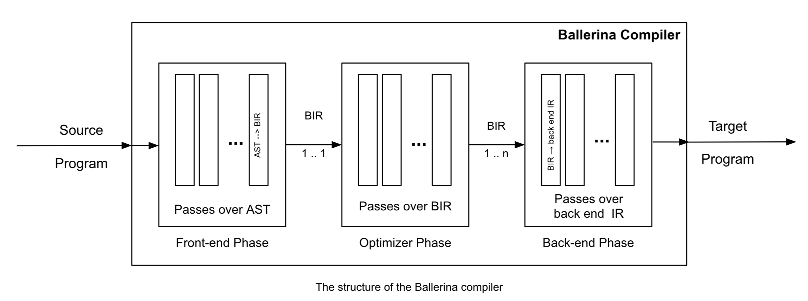
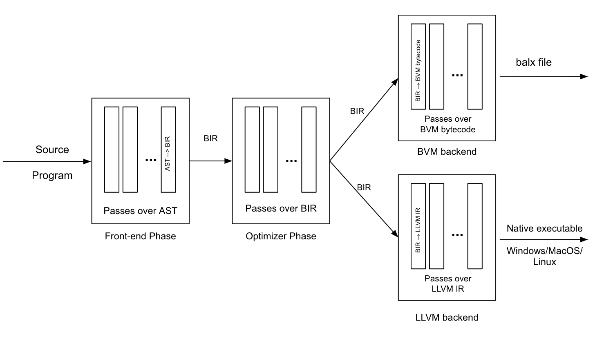
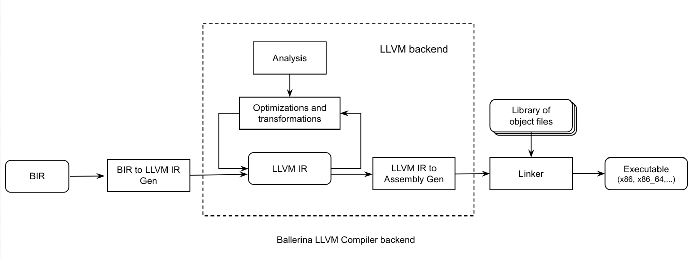

# Ballerina Compiler Architecture

- Issue: [ballerina-lang/issues/10256](https://github.com/ballerina-platform/ballerina-lang/issues/10256)
- PR: [ballerina-lang/pulls/10258](https://github.com/ballerina-platform/ballerina-lang/pull/10258)

This document describes the proposed Ballerina compiler architecture. It comes with significant changes to the existing architecture to support compiling Ballerina programs to native executables.

## Requirements/Objectives 
- Faster startup time and less memory usage compared to the Java-based BVM.
- Single distributable compiled package format that can be stored in BALOs.
- Single compiler architecture which can produce executables for multiple targets:
    - The BVM (Ballerina runtime/virtual machine that interprets Ballerina bytecode)
    - Three main operating systems (Linux, Windows, Mac OS) 
    - Mobile operating systems? 
    - WebAssembly machine?
    - JVM?
    
## Ballerina Compiler
Ballerina compiler transforms a Ballerina program to a target-specific executable program. A Ballerina program consists of one or more packages. A package consists of one or more Ballerina source files (.bal) and the package is the unit of compilation; the Ballerina compiler translates the source form of a package into its binary form. 

Here is the proposed Ballerina compiler design. It is based on the standard three-phase compiler model. The phases are called the front-end phase, optimizer phase, and back-end phase respectively. Each phase consists of one or more passes over the phase-specific intermediate representation(IR) of the Ballerina program.

The front-end phase focuses on validating the correctness of the source program. The optimizer phase focuses on analyzing the program and rewriting it into a more efficient version. The back-end phase focuses on translating the program into a target-specific version.

### Abstract Syntax Tree (AST)
The front-end phase transforms the source program into an intermediate representation(IR) called abstract syntax tree (AST). The components in the front-end phase such as package-level symbol creator and type checker make multiple passes over the AST to validate the correctness of the program. Each pass over the AST enriches the AST with additional information such as the types of variables and expressions, definitions of symbols, etc. The last pass in the front-end phase converts AST into another IR called Ballerina intermediate representation (BIR).

AST is usually closer to the source code because it retains the essential structure of the source program. Also, AST is a graphical IR because it encodes information in a graph. All the language constructs including syntactic sugar are usually available in the AST. Therefore the AST encodes too much information that is not required for the optimizer and back-end phases. The solution is to convert the AST into a form that has only a basic set of language constructs such as if-else statement, while loop, function calls, goto statements,  This process is called lowering or desugaring: removing syntactic sugar. The match statement in Ballerina can be easily desugared into an if-else statement and different kinds of looping construct can be desugared into a while loop. The resulting intermediate representation is called BIR.

### Ballerina Intermediate Representation (BIR)
The optimizer phase performs data-flow and control-flow analysis by making multiple passes over the BIR. The algorithms used to perform data-flow and control-flow analysis expects a control-flow graph (CFG). CFGs correctly represents the execution flow of a program. It also allows us to analyze all the execution paths of a program or a function. The following image shows the CFGs of a Ballerina program with nested if-else and while statements.

BIR is a CFG. BIR is also a hybrid IR because it combines the properties of both graphical and linear IRs as illustrated in about image. The simplest unit of a control-flow graph is called a basic block. A basic block contains a set of instructions that always execute together. The last instruction in a basic block usually connects with one or more basic blocks. Therefore the last instruction is called the terminator. You can find read more about BIR in the [specification](bir-spec.md). 

### Compiled Package Archive (BALO)
The optimizer phase emits a more efficient BIR by rewriting it based on the results of various analysis passes over the unoptimized BIR which is the output of the front-end phase. Both front-end and optimizer phases work on a single package at a time and produce the BIR of a package. Then the compiler stores the binary form of the BIR in the compiled package archive (balo) file. 
 
A balo file contains the binary form of BIR and other resources such as the package source code and package documentation. It is an archive file which can be stored in Ballerina package repositories. 

The back-end phase of the Ballerina compiler traverses the BIR stored in a compiled package archives and emit target-specific instructions to generate an executable program. There will most probably be more than one backends which target different machines.  

## Front-end Phase
This phase validates that the source program is syntactically and semantically correct. Here are some of the key components in the front-end phase. 

The output of this phase is the unoptimized (BIR). Tools such as Language server, composer use only the front-end phase. 

#### Lexical analyzer and parser
- Convert the source code text into a set of tokens. 
- Creates the AST from the parse tree which is created using the set of tokens.
#### Symbol creator 
- Creates symbols and relevant scopes for the package, and package-level constructs such as functions, variables, types. 

#### Type checker 
- Checks the correctness of the program based on the typing rules defined by the Ballerina language specification. This component is also responsible for inferring the types of variables, expression based on sub-expressions and the context.
#### Desugar 
- Removes the syntactic sugar from the AST by rewriting certain parts of the tree.
#### BIRGen 
- Lower the AST to BIR.

_Implementation: This phase is completely implemented in Java at the moment. Once we have a stable ANTLR target for Ballerina, we can invest in rewriting this phase using Ballerina itself._ 

## Optimizer Phase
This phase optimizes the source program by performing an analysis followed by a transformation. E.g. data-flow analysis and rewrite the IR. This phase takes the unoptimized BIR as the input and output the analyzed, transformed and optimized BIR. The optimizer phase performs target-independent code optimization whereas individual compiler backends may perform target-specific code optimization. 

Similar to the front end phase, this phase also understands the Ballerina language semantics. Therefore we can perform various Ballerina-specific optimizations. 

_Implementation: This phase will be fully implemented in Ballerina._ 

## Back-end Phase
This phase combines one or more compiled packages(BIRs in BALOs) to create a target-specific executable program. It traverses the BIR and emits instructions/bytecode for the target machine. There are more than one compiler backends in Ballerina as illustrated in the following diagram. 

Here is a list of possible Ballerina compiler backends.

- Ballerina BVM compiler backend  - generates bytecode for the Java-based Ballerina runtime.
- Ballerina LLVM compiler backend - generates native executables for Linux, MacOS, Windows environments. 
- Ballerina WebAssembly backend - generates WebAssembly instructions. (Not yet implemented)

### Ballerina BVM compiler backend

Ballerina runtime is a runtime environment that is required to execute Ballerina programs compiled down to Ballerina bytecode. BVM is the virtual machine in Ballerina runtime that interprets Ballerina bytecode. I.e. runs a Ballerina program. Following diagram shows the components in Ballerina runtime. 

Ballerina bytecode is the instruction set that the BVM understands. If you are familiar with Java bytecode, you may find Ballerina bytecode similar to Java counterparts. But there is a big difference in the way we interpret these instructions. We designed BVM architecture, and the instruction set by following the register-based virtual machine architecture. There are two main VM architectures: Register-based and Stack-based. JVM is based on the stack-based architecture, while the LUA VM and Dalvik VM are based on the register-based architecture. You can find a plenty of articles which explains these two architectures. These VM architectures differ from each other in how they store and load operands of the instructions.

This compiler backend produces a balx file (an executable file that runs on BVM) by linking the entry package and other imported packages (except the ballerina/* packages). During this process, this backend converts BIR into Ballerina bytecode for each package. 

_Note_: This backed will probably have a short lifetime. Once the Ballerina LLVM compiler backend is stable enough, we will deprecate the BVM backend.

_Implementation: This backend will be implemented in Ballerina._

### Ballerina LLVM compiler backend
Ballerina LLVM backend is responsible for generating native executables. It uses LLVM for the most part. LLVM is a compiler development framework which is defined as a “collection of modular and reusable compiler and toolchain technologies” in LLVM website[4]. It has been used to develop both compiler frontends and backends, but in here we have used it to implement the backend which generates machine code. In LLVM terminology, the term “LLVM backend” refers to the module in LLVM  that converts LLVM IR into object code(or assembly). We have used the term “Ballerina LLVM compiler backend” to avoid the confusion. 

LLVM IR is the common information model that connects compiler frontends and backends. If you compare LLVM IR with BIR, you would realize that there are many similarities:
Instructions in functions are organized as basic blocks that form a CFG, 
Typed variables and operations, 
A distribution format

However, LLVM IR is a static single assignment (SSA) based representation whereas BIR is not. BIR is closer to Ballerina source language whereas LLVM is an independent representation which has low-level level constructs. 

Following diagram illustrates the high-level components in this backend.

The First step is to generate LLVM IR from BIR. Thereafter we handover the LLVM IR to the LLVM backend. It produces the target-specific object code (or assembly) after performing many analysis and optimizations over the LLVM IR. Then the object code is linked with other libraries to produce the executable. 

## References
[1] https://blog.rust-lang.org/2016/04/19/MIR.html

[2] https://github.com/apple/swift/blob/master/docs/SIL.rst

[3] http://www.llvm.org/
