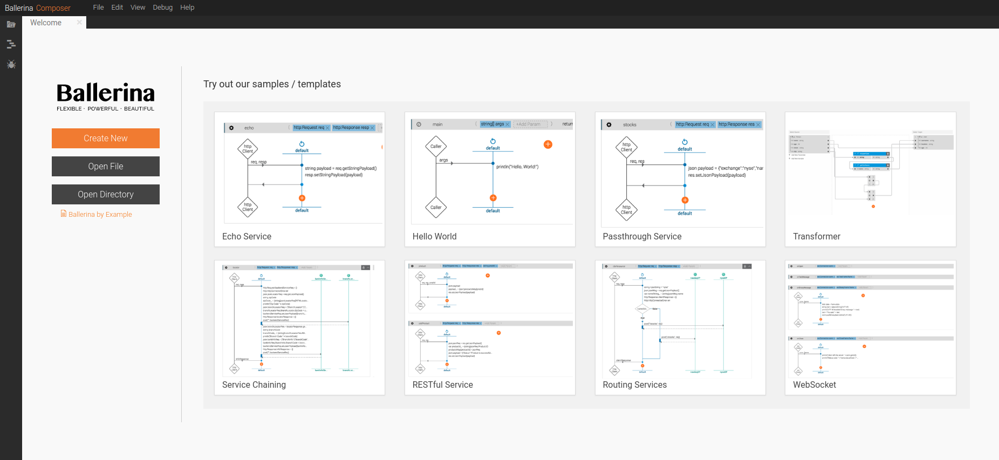

# Quick Tour

Now that you know [a little bit about Ballerina](index.md), let's take it for a spin! 

These are the available sections in this tour.

- [Install Ballerina](#install-ballerina)
- [Run HelloWorld](#run-helloworld)
- [Build, Run, and Call the Service](#build-run-and-call-the-service)


## Install Ballerina

1. Go to [http://www.ballerinalang.org](http://www.ballerinalang.org) and click **Download**. 
1. Download the Ballerina Tools distribution and unzip it on your computer. Ballerina Tools includes the Ballerina runtime plus the visual editor (Composer) and other tools. 
1. Add the `<ballerina_home>/bin` directory to your $PATH environment variable so that you can run the Ballerina commands from anywhere. 

>NOTE: Throughout this documentation, `<ballerina_home>` refers to the Ballerina directory you just installed. 

## Run HelloWorld

The Hello World program will show you how easy it is to run Ballerina, send it a request, and get a response. 

Let's take a look at what the code looks like in the Ballerina programming language:

```
import ballerina.io;
function main (string[] args) {
    io:println("Hello, World!");
}
``` 

The above code doesn't take any specific input, so simply running it will cause it to print "Hello, World!" at the command line. To run this, copy the above code into a hello-world.bal file.

At the command prompt, navigate to the directory that contains the hello-world.bal file and enter the following line:

```
$ ballerina run hello-world.bal
```

You will see the following response:

```
Hello, World!
```

You just started Ballerina, ran a simple code, and got a response within seconds. 

Pretty simple and straightforward, right? Now, let's look at running the same Hello World program as a service.

## Build, Run, and Call the Service

Now let's change the Hello World program to a service. Open the hello-world.bal file you just created

```
import ballerina/net.http;
import ballerina/io;

// A service endpoint listens to HTTP request on port 9090
endpoint http:ServiceEndpoint listener {
    port:9090
};

// A service is a network-accessible API
// Advertised on '/hello', the port comes from the listener endpoint
service<http:Service> hello bind listener {

    // A resource is an invokable API method
    // Accessible on '/hello/sayHello
    // 'caller' is the client invoking this resource 
    sayHello (endpoint caller, http:Request request) {
        http:Response response = {};
        // Set the response payload
        response.setStringPayload("Hello Ballerina!\n");
        // Send a response back to caller
        // Errors that could occur are ignored using '_'
        _ = caller -> respond(response);
    }
}
```

You can run the service by using the same run command you used to run the program earlier.

```
$ ballerina run hello-world.bal
```

You will see the following response.

```
ballerina: deploying service(s) in 'hello-world.bal'
ballerina: started HTTP/WS server connector 0.0.0.0:9090
```

This means your service is up and running. 

Now, in addition to running the program, let's build it as well. Run the following command to build the program.

```
ballerina build hello-world-service.bal
```

When you list the folders in the directory you can see there is a new executable file built with a `.balx` extension.

```
hello-world.bal		hello-world.balx
```

You can call the service by opening a new command line window and using the following cURL command.

```
curl http://localhost:9090/hello/sayHello
```

You get the following response.

```
Hello Ballerina!
```

## Run the Composer

1. In the command line, type `composer`.

1. Access the Composer from the following URL in your browser: http://localhost:9091

    The welcome page of Ballerina Composer appears. 
    
    
    
